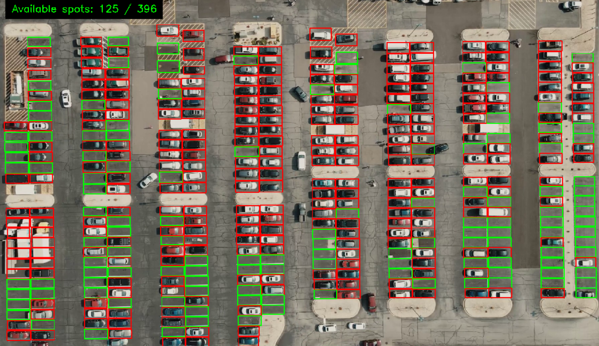

# 🅿️ Parking Spot Detection System

<p align="center">
  
  
</p>

## 📝 Overview
This project is a machine learning and computer vision solution designed to detect and report available parking spots in real-time. Utilizing video feed from parking lots, the system employs advanced algorithms to monitor and identify the occupancy status of each parking space. This can be particularly useful for parking management in malls, airports, and urban centers, enhancing the efficiency of space usage and the user experience.

## 🖼️ Demo


## 📦 Requirements
The following libraries are needed to run this project:

- OpenCV (Computer Vision)
- scikit-learn (Machine Learning)
- pandas (Data Handling)
- Pillow (Image Processing)
- Matplotlib (Plotting)
- scikit-image (Image Processing)

## ⚙️ Installation
Clone this repository and navigate to the project directory. Install the dependencies with the following command:

```bash
pip install -r requirements.txt
```

## 🚀 Usage
Execute the `main.py` script to start the parking spot detection:

```bash
python main.py
```

`util.py` contains utility functions that handle image processing and machine learning model predictions.

## 🤖 How it Works
`main.py` processes the video feed to detect changes in the parking spots using connected component analysis and applies a pre-trained machine learning model to determine the vacancy of each spot.

The model, loaded in `util.py`, predicts if a parking spot is empty based on the processed image data.

## ⚙️ Configuration
You can adjust the detection sensitivity and other parameters by modifying the designated variables within `main.py`.

## 🤝 Contribution
Contributions are welcome! Please read the contribution guidelines before submitting a pull request.

## 📄 License
This project is open-sourced under the [MIT License](LICENSE).

---

Feel free to reach out for any queries or support regarding this project.

Happy Parking! 🚗